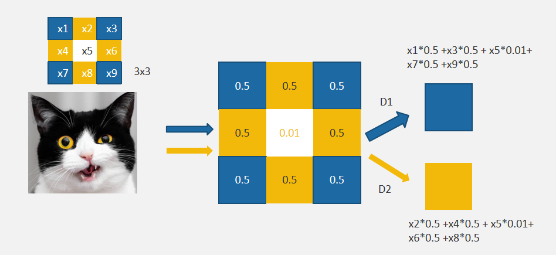
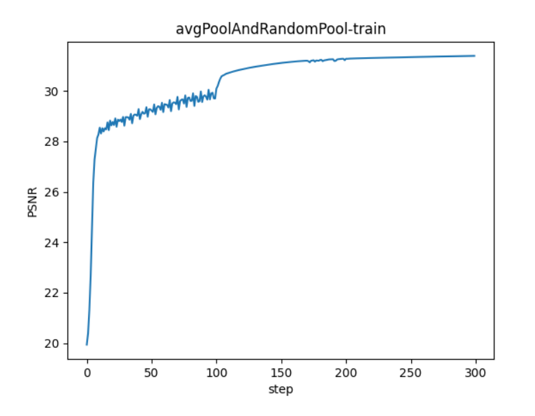

# N2N论文复现
## Part1 论文解读
> Noise2Noise-Learning Image Restoration without Clean Data

### 1.1论文贡献
- 可以仅仅通过**无标签**的噪声信号重建无噪的信号，而**不需要干净**的样本，并且性能上超越了运用干净数据进行训练的性能。

### 1.2理论推导
#### 1.2.1基础分析
**假设**:我们的一组噪声图片为 $y_1 = x + e_1,y_2 = x + e_2$ ,那么我们的降噪模型为 $f_\Theta$,那么降噪后的图像即为 $f_\Theta(y) = f_\Theta(x + e)$

基于以上假设的loss函数为: $\frac{1}{n}\Sigma_{i = 1}^{n}||f_\Theta(y_1) - y_2||^2$，进行梯度下降即可

**分析**:作者提出了一组噪声图像 $y_1,y_2$中， $y_1$向 $y_2$进行映射和 $y_1$向clean的图像进行映射的作用是相同的(此处有点难以理解)

#### 1.2.2实际方法
作者通过针对输入的噪声图像进行了pair downsample，这种方式比较巧妙,图像通过两个卷积核进行下采样，得到两张采样之后的噪声图像，具体采样方式如下：


作者提出，在一张clean的图像中像素点之间是存在强相关性的，因此作者这种方式可以理解为D1和D2两种采样方式在原clean图像上采样得到理论上来说是具有极强相似性的图像，值得注意的是，由于采样降低了图像的像素点个数，高频噪声采样之后会变得非常显著。

同时作者用一个简单的CNN模型实现D1(y) -> D2(y)，去噪操作后续进行详细讲解

#### 1.2.3最终loss公式推导
根据残差学习方法，我们将去噪模型定义为 $F_\Theta(x)= x - f_\Theta(x)$, 那么根据1.2.1节中的理解，loss函数就有如下：
 $||F_\Theta(y_1) - y_2||^2$

即: $||D_1(y) - f_\Theta(D_1(y)) -D_2(y)||^2$ (原论文给出的公式,一眼很难理解)

然后，根据**对称性**，就可以得到正则化 $L_{res}$函数:
 $L_{res} = ||D_1(y) - f_\Theta(D_1(y)) -D_2(y)||^2/2 +   ||D_2(y) - f_\Theta(D_2(y)) -D_1(y)||^2/2$

再由**一致性**(经过下采样之后的图像经过去噪得到的结果和去噪之后的图像再下采样的结果一致)可以得到：
$L_{cons} = ||D(y) - f_\Theta(D(y)) - D(y - f_\Theta(y))||^2  = 
(D_1(y) - f_\Theta(D_1(y)) - D_1(y - f_\Theta(y))+ D_2(y) - f_\Theta(D_2(y)) - D_2(y - f_\Theta(y)))/2 $

最终的loss函数为 $L_{res} + L_{cons}$

## Part2 论文复现
### 2.1原论文结果展示
根据原论文代码和参数，直接展示原论文给出图像的最终结果：


>max_epoch = 3000     # training epochs 
>lr = 0.001           # learning rate 0.001
>step_size = 1000     # number of epochs at which learning rate decays
>gamma = 0.5          # factor by which learning rate decays

训练过程中每个step的**PSNR**如下:


### 2.2试用不同采样方式
为了达到和原论文的采样方式的对比，我们无特殊说明以下训练过程中使用与原论文demo相同的训练参数:

#### 2.2.1边缘正权重
原论文中使用的是正方形对角线的正反采样点，正对角线忽略了反对角线的像素值，因此尝试去让卷积核增加另一条对角线上的像素点权值为非0，再进行训练。 
```python
 #边缘权重
filter1 = torch.FloatTensor([[[[0.1 ,0.5],[0.5, 0.1]]]]).to(img.device)
filter1 = filter1.repeat(c,1, 1, 1)

filter2 = torch.FloatTensor([[[[0.5 ,0.1],[0.1, 0.5]]]]).to(img.device)
filter2 = filter2.repeat(c,1, 1, 1)

output1 = F.conv2d(img, filter1, stride=2, groups=c)/1.1
output2 = F.conv2d(img, filter2, stride=2, groups=c)/1.1
```
训练结果如下：


#### 2.2.2边缘负权重
具体方法同2.2.1。
```python
# original  负边缘权重
filter1 = torch.FloatTensor([[[[-0.1 ,0.5],[0.5, -0.1]]]]).to(img.device)
filter1 = filter1.repeat(c,1, 1, 1)

filter2 = torch.FloatTensor([[[[0.5 ,-0.1],[-0.1, 0.5]]]]).to(img.device)
filter2 = filter2.repeat(c,1, 1, 1)

output1 = F.conv2d(img, filter1, stride=2, groups=c)/0.8
output2 = F.conv2d(img, filter2, stride=2, groups=c)/0.8
```
训练结果如下：


可以发现，在对角线使用权值还不能达到接近跟原论文一样的效果

#### 2.2.3 ThreeSizeSample(3X3)
基于原论文举一反三，根据pair sample在3x3的卷积核上的实现，具体采样方式如下：

```python
 #3X3 sample
filter1 = torch.FloatTensor([[[[0 ,0.5,0],[0.5, 0.01,0.5],[0 ,0.5,0]]]]).to(img.device)
filter1 = filter1.repeat(c,1, 1, 1)

filter2 = torch.FloatTensor([[[[0.5 ,0,0.5],[0, 0.01,0],[0.5 ,0,0.5]]]]).to(img.device)
filter2 = filter2.repeat(c,1, 1, 1)

output1 = F.conv2d(img, filter1, stride=3, groups=c)/2.01
output2 = F.conv2d(img, filter2, stride=3, groups=c)/2.01
```

训练结果如下:


**分析**:根据原论文的基本前提，图像的每个像素点与周围采样点具有相关性，因此，我们可以根据采样周围的点来代替原像素点，这种采样方法我认为是对原像素点的一种平滑。

但是**值得注意的是**，本采样方法并没有将3x3卷积核最中间的权值设置为0,而是给与了一个较小的值0.01(虽然是按照经验给值)。

**原因**：我将我尝试过从0-0.5中间的各种取值，最终去噪的效果并不是和取值有很强的相关性。取值为0时，效果不如0.01，然而增大为0.2时，效果也不如0.01。
面对这种现象，我给出的分析是，中心点取值为0这种采样方式只注重了周围像素点对中心像素点的贡献，然而没有尊重本身像素点的取值。当然，当中心像素点的权值变的很大时，两种采样方式得到的采样图像的区别就会越来越小，那么最终模型的降噪效果自然就不会很好了。

#### 2.2.4 strip
将采样点从对角线变为了竖直，这种方式可能对具有沿x轴方向的噪声具有比较好的降噪效果，实际效果跟原论文效果相差没有很大，最终得到的PSNR值为29.18。
```python
# 2X2 条纹
filter1 = torch.FloatTensor([[[[0 ,0.5],[0, 0.5]]]]).to(img.device)
filter1 = filter1.repeat(c,1, 1, 1)

filter2 = torch.FloatTensor([[[[0.5 ,0],[0.5, 0]]]]).to(img.device)
filter2 = filter2.repeat(c,1, 1, 1)

output1 = F.conv2d(img, filter1, stride=2, groups=c)
output2 = F.conv2d(img, filter2, stride=2, groups=c)
```

#### 2.2.5 maxAndAvgPool
现在开始，我们尝试用池化来进行采样，使用池化的方式好处是可以对像素点进行非定位的采样，也就是说不局限于单个像素点的计算方式，转而从整体感受野来进行定性分析。(初始学习率为0.005)
```python
# 池化
output1 = F.max_pool2d(img,kernel_size=2, stride=2)
output2 = F.avg_pool2d(img,kernel_size=2, stride=2)
```
具体结果如下：

训练过程如下：


这里可以看到单纯的不灵活的池化方式对图像降噪效果可以说是一点不好，即便进行调参也很难达到接近原论文的效果。

#### 2.2.6 maxPoolAndRandomPool
根据网上资料,查阅到随机池化的方法，torch中并没有封装好的代码，具体实现见utils.py。

**选择随机池化的理由**：在随机池化中，元素值大的被选中的概率也大，但不是像最大池化总是取最大值。随机池化一方面最大化地保证了Max值的取值，一方面又确保了不会完全是max值起作用，造成过度失真。除此之外，其可以在一定程度上避免过拟合。

因此我们使用max和随机池化两种池化方式来进行采样，最终得到两种采样之后的图像。

```python
 # 随机池化
output1 = F.max_pool2d(img,kernel_size=2, stride=2)
randomPooler =  StochasticPool2DLayer(maxpool=False, training=True)
output2 = randomPooler(img)
```
最终结果如下:

这种方式最终的效果只能说是比2.2.5 的方式好一点点，但是也只是五十步笑百步。原因是max和随机池化本就是在max上增加了随机性，最终本质没有区别。

#### 2.2.7 avgPoolAndRandomPool
这是7种采样方式种的最后一种，这种采样方式的结果相比maxAndAvg采样方式好了很多，即便只是在采样方式上引入了随机性。
```python
 # 随机池化
output1 = F.avg_pool2d(img,kernel_size=2, stride=2)
randomPooler =  StochasticPool2DLayer(maxpool=False, training=True)
output2 = randomPooler(img)
```


这种采样方式，引入采样像素点的随机性可以按照概率随机抓取噪声，按照采样方式，随机池化可以抓取到e(叠加的噪声值)为正的噪声，同时也不会忽略e为负的噪声，这种采样方式在训练的过程中每次采样的结果不会一样，从而提升了模型的泛化能力，减少了过拟合。

最终的训练结果PSNR为29.19。

### 2.2.8   avgPoolAndRandomPool_step（更新）

```python
    if use_step_filter and (mini_epoch < 1000 ) :
        if mini_epoch != None and mini_epoch % 2 == 0:
            sampleType = downsamplerType["stripe"] # todo change

        if mini_epoch != None and mini_epoch % 3 == 0:
            sampleType = downsamplerType["stripeReverse"] # todo change

        if mini_epoch != None and mini_epoch % 5 == 0:
            sampleType = downsamplerType["remoteWeight"] # todo change

        if mini_epoch != None and mini_epoch % 10 == 0:
            sampleType = downsamplerType["remoteNegativeWeight"] # todo change threeSizeSamplePlus

        if mini_epoch != None and mini_epoch % 20 == 0:
            sampleType = downsamplerType["threeSizeSample"] # todo change remoteNegativeWeight

        return *downsampler_tool(img,sampleType, upSample),sampleType

    if 1000<= mini_epoch <= 3000:
        return *downsampler_tool(img,downsamplerType["stripeReverse"], upSample),downsamplerType["stripeReverse"]
```

​	这种方式是前几种方式的综合使用，一般情况下，使用效果最好的avgPoolAndRandomPool方法来进行采样,在epoch小于500时，模型的epoch数值满足以上条件的时候进行对应的采样，当大于1000时，统一使用stripReverse方法来进行采样(**注:stripReverse 的采样核为[[[0.5, 0.5], [0, 0]] 和[[0, 0], [0.5, 0.5]]**)。这种方式综合了stripe、stripeReverse、remoteWeight、remoteNegativeWeight、threeSizeSample的多项优点能迅速拟合，并且能后期使用stripeReverse方法来进行优化。



​	**最终在原论文测试的图像上达到的效果为31.392125396133945 ，比31.28还高0.11**
​	但是这种方法在总体数据集上的效果比原论文的效果稍微偏差，但是相比其他单纯使用采样方法效果有所提升。这说明：在Zero short的N2N方法中，通过适当更换合适的采样方法可以提升模型的降噪效果。

​	

### 2.3不同采样不同噪声对比
#### type:gauss level:25
| 采样方法 | orignal | remoteWeight |remoteNegativeWeight|threeSizeSample|stripe|maxAndAvgPool|avgPoolAndRandomPool|maxPoolAndRandomPool|
|:-------:|:-------:|:-------:|:-------:|:-------:|:-------:|:-------:|:-------:|:-------:|
| PSNR | 31.28 |27.5 |27.83 |29.86 |29.18 | 23.58 | 29.19 | 22.98 |


#### type:gauss level:50 
| 采样方法 | orignal | remoteWeight |remoteNegativeWeight|threeSizeSample|stripe|maxAndAvgPool|avgPoolAndRandomPool|maxPoolAndRandomPool|
|:-------:|:-------:|:-------:|:-------:|:-------:|:-------:|:-------:|:-------:|:-------:|
| PSNR | 26.66 |21.07 |22.32 |25.07 |25.90 |19.68 |25.10 |17.44 |

#### type:gauss level:100 
| 采样方法 | orignal | remoteWeight |remoteNegativeWeight|threeSizeSample|stripe|maxAndAvgPool|avgPoolAndRandomPool|maxPoolAndRandomPool|
|:-------:|:-------:|:-------:|:-------:|:-------:|:-------:|:-------:|:-------:|:-------:|
| PSNR | 20.65 |16.52 |16.94 |20.08 |20.52 |14.51 |19.97 |12.53 |

## Part3 结论
### 3.1 边缘正权重和边缘负权重
这两种采样方式通过修改卷积核权重，来强调或抑制图像中的边缘信息。正权重可能有助于保留边缘，而负权重则可能有助于抑制边缘噪声。然而，由于这些权重只集中在对角线方向，可能会忽略图像中的其他重要信息。

- **优势**：可以针对性地强调或抑制边缘信息。
- **劣势**：可能导致图像其他方向的信息丢失，影响整体视觉效果。

### 3.2 ThreeSizeSample(3X3)
这种采样方式通过3x3卷积核的不同权重分配来捕捉图像的局部特征。中心点权值设置为0.01，这是为了在保留中心像素信息的同时，减少其对采样结果的影响，避免过度强调中心像素。

- **优势**：能够捕捉到更多的局部特征，中心点的非零权值有助于平衡采样结果。
- **劣势**：如果权值设置不当，可能会导致图像细节的丢失或噪声的过度平滑。

### 3.3 Stripe
通过将采样点变为竖直方向，这种采样方式可能对沿x轴方向的噪声有较好的降噪效果。PSNR值29.18表明其效果与原论文相近，说明这种采样方式在处理特定类型的噪声时可能更为有效。

- **优势**：针对性强，对于沿特定方向的噪声有较好的降噪效果。
- **劣势**：可能无法有效处理其他方向的噪声。

### 3.4 MaxAndAvgPool
使用最大池化和平均池化进行采样，这两种池化方法各有优势：最大池化可以保留图像中的显著特征，而平均池化则有助于平滑噪声。然而，这种方法的降噪效果不佳，可能是因为这两种池化方式都较为固定，缺乏灵活性。

- **优势**：池化操作可以简化图像，减少计算量。
- **劣势**：固定的池化操作可能无法适应图像中的复杂噪声模式。

### 3.5 MaxPoolAndRandomPool
结合最大池化和随机池化，这种方法试图通过引入随机性来增加采样的多样性。然而，由于最大池化总是取最大值，这可能会限制随机池化的效果。

- **优势**：随机池化可以增加采样的多样性。
- **劣势**：最大池化的特性可能会限制随机池化的优势。

### 3.6 AvgPoolAndRandomPool
这种方法通过平均池化和随机池化结合，引入了更多的随机性，有助于提高模型的泛化能力和减少过拟合。较高的PSNR值表明这种采样方式在尝试的方法中效果较好。

- **优势**：结合了平均池化的平滑效果和随机池化的多样性。
- **劣势**：需要仔细调整参数以避免过度随机化导致的性能下降。

### 3.7 综述
- 根据对N2N论文的解读，本文总结了N2N算法的流程和方式。
- N2N方法提供了一种在没有干净数据的情况下进行图像去噪的有效途径。
- 本文通过多种采样方法的尝试和对比，发现引入随机性的采样方法能够提高模型的泛化能力和去噪效果。并且与max_pool进行组合，**得到的MaxPoolAndRandomPool具有良好的接近原论文的效果**。,虽然没有进行列举，在其他噪声中，如服从泊松分布的噪声图像，效果与原论文媲美。
- 在实际应用中，选择合适的采样方法对于提高去噪性能至关重要，本文噪声为**高斯噪声**，在时间允许下可以进行更多噪声的对比和尝试。

### 3.8 后续工作
- 因为存在清晰图像，所以本文使用的PSNR参数用于最终图像效果的评判。对于无清晰图像的数据，我们可以通过sobel算子、Brenner梯度函数等这类无参考的清晰度判定方法来进行采样方法的对比，兴许可以挖掘出不同采样方法相比原论文采样的优势。


## Part4 噪声水平与PSNR值对比表（更新）

### Gauss噪声类型

#### 1.噪声水平 10

| **数据集**   | **样本类型**              | **PSNR值（dB）** |
| ------------ | ------------------------- | ---------------- |
| **Kodak24**  | **original**              | **31.765**       |
| **McMaster** | **original**              | **32.607**       |
| Kodak24      | avgPoolAndRandomPool      | 29.063           |
| McMaster     | avgPoolAndRandomPool      | 29.921           |
| Kodak24      | threeSizeSample           | 31.023           |
| McMaster     | threeSizeSample           | 31.382           |
| Kodak24      | stripe                    | 29.390           |
| McMaster     | stripe                    | 29.936           |
| Kodak24      | avgPoolAndRandomPool_step | 29.017           |
| McMaster     | avgPoolAndRandomPool_step | 30.420           |

### 2.噪声水平 25

| **数据集**   | **样本类型**              | **PSNR值（dB）** |
| ------------ | ------------------------- | ---------------- |
| **Kodak24**  | **original**              | **28.201**       |
| **McMaster** | **original**              | **27.720**       |
| Kodak24      | avgPoolAndRandomPool      | 26.611           |
| McMaster     | avgPoolAndRandomPool      | 26.647           |
| Kodak24      | threeSizeSample           | 27.060           |
| McMaster     | threeSizeSample           | 26.504           |
| Kodak24      | stripe                    | 27.138           |
| McMaster     | stripe                    | 26.895           |
| Kodak24      | avgPoolAndRandomPool_step | 27.085           |
| McMaster     | avgPoolAndRandomPool_step | 27.099           |

### 3.噪声水平 50

| 数据集       | 样本类型                  | PSNR值（dB） |
| ------------ | ------------------------- | ------------ |
| **Kodak24**  | **original**              | **24.265**   |
| **McMaster** | **original**              | **23.227**   |
| Kodak24      | avgPoolAndRandomPool      | 23.549       |
| McMaster     | avgPoolAndRandomPool      | 22.861       |
| Kodak24      | threeSizeSample           | 23.301       |
| McMaster     | threeSizeSample           | 22.339       |
| Kodak24      | stripe                    | 23.954       |
| McMaster     | stripe                    | 22.996       |
| Kodak24      | avgPoolAndRandomPool_step | 23.997       |
| McMaster     | avgPoolAndRandomPool_step | 23.079       |

### Poiss噪声类型

### 1.噪声水平 10

| 数据集       | 样本类型                  | PSNR值（dB） |
| ------------ | ------------------------- | ------------ |
| **Kodak24**  | **original**              | **24.640**   |
| **McMaster** | **original**              | **24.738**   |
| Kodak24      | avgPoolAndRandomPool      | 23.889       |
| McMaster     | avgPoolAndRandomPool      | 24.384       |
| Kodak24      | threeSizeSample           | 23.379       |
| McMaster     | threeSizeSample           | 23.209       |
| Kodak24      | stripe                    | 24.380       |
| McMaster     | stripe                    | 24.526       |
| Kodak24      | avgPoolAndRandomPool_step | 24.517       |
| McMaster     | avgPoolAndRandomPool_step | 24.733       |

### 2.噪声水平 25

| 数据集       | 样本类型                  | PSNR值（dB） |
| ------------ | ------------------------- | ------------ |
| **Kodak24**  | **original**              | **27.110**   |
| **McMaster** | **original**              | **27.282**   |
| Kodak24      | avgPoolAndRandomPool      | 25.907       |
| McMaster     | avgPoolAndRandomPool      | 26.470       |
| Kodak24      | threeSizeSample           | 25.821       |
| McMaster     | threeSizeSample           | 25.838       |
| Kodak24      | stripe                    | 26.354       |
| McMaster     | stripe                    | 26.724       |
| Kodak24      | avgPoolAndRandomPool_step | 26.401       |
| McMaster     | avgPoolAndRandomPool_step | 26.893       |

### 3.噪声水平 50

| 数据集       | 样本类型                  | PSNR值（dB） |
| ------------ | ------------------------- | ------------ |
| **Kodak24**  | **original**              | **28.780**   |
| **McMaster** | **original**              | **29.136**   |
| Kodak24      | avgPoolAndRandomPool      | 27.028       |
| McMaster     | avgPoolAndRandomPool      | 27.808       |
| Kodak24      | threeSizeSample           | 27.612       |
| McMaster     | threeSizeSample           | 27.770       |
| Kodak24      | stripe                    | 27.573       |
| McMaster     | stripe                    | 28.068       |
| Kodak24      | avgPoolAndRandomPool_step | 27.559       |
| McMaster     | avgPoolAndRandomPool_step | 28.376       |